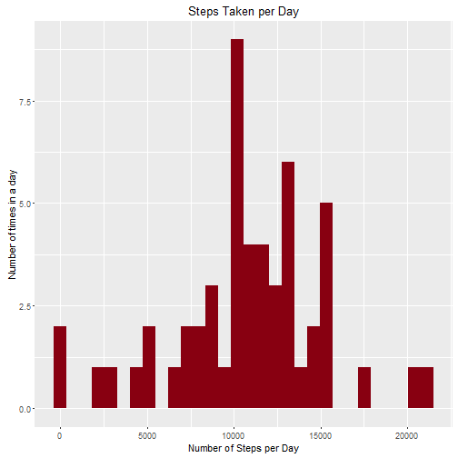
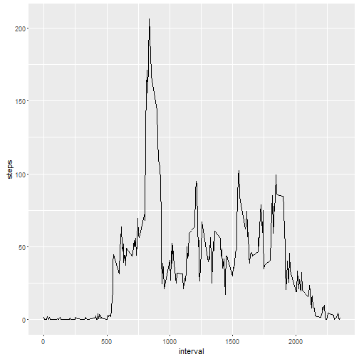
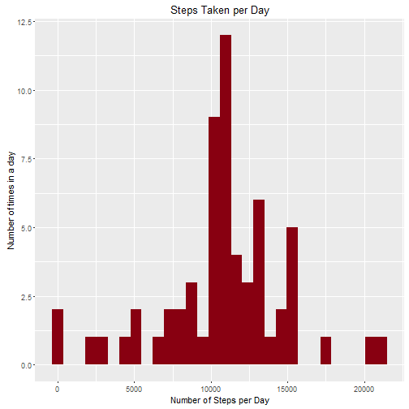
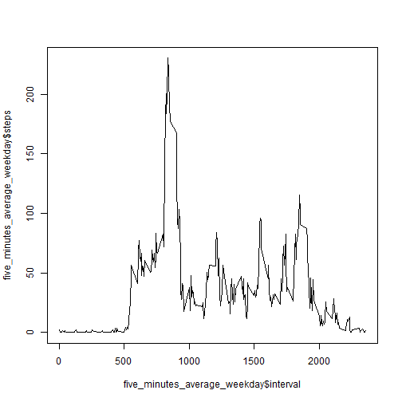
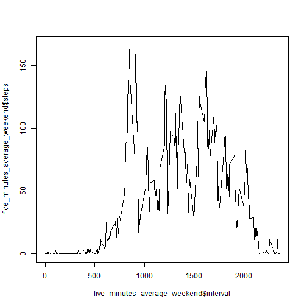

<<<<<<< HEAD
#Loading and preprocessing the data
Show any code that is needed to

Load the data (i.e. read.csv())
I downloaded and unziped the file from the Cousera Site. And, I loaded the "activity.csv" from my Hard disk (C)


```r
data <- read.csv("C:/Users/rroyyuru/Desktop/Rep/activity.csv")
  dim(data)
```

```
## [1] 17568     3
```
Process/transform the data (if necessary) into a format suitable for your analysis
Was not need to Process or transform the data


```r
subdata = data[!is.na(data$steps), ]  
dim(subdata)
```

```
## [1] 15264     3
```

#What is mean total number of steps taken per day?
For this part of the assignment, you can ignore the missing values in the dataset.

Calculate the total number of steps taken per day
Calculating the total number of steps taken per day

```r
num.steps.date <- aggregate(subdata$steps, list(subdata$date), sum)
num.steps.date
```

```
##       Group.1     x
## 1  2012-10-02   126
## 2  2012-10-03 11352
## 3  2012-10-04 12116
## 4  2012-10-05 13294
## 5  2012-10-06 15420
## 6  2012-10-07 11015
## 7  2012-10-09 12811
## 8  2012-10-10  9900
## 9  2012-10-11 10304
## 10 2012-10-12 17382
## 11 2012-10-13 12426
## 12 2012-10-14 15098
## 13 2012-10-15 10139
## 14 2012-10-16 15084
## 15 2012-10-17 13452
## 16 2012-10-18 10056
## 17 2012-10-19 11829
## 18 2012-10-20 10395
## 19 2012-10-21  8821
## 20 2012-10-22 13460
## 21 2012-10-23  8918
## 22 2012-10-24  8355
## 23 2012-10-25  2492
## 24 2012-10-26  6778
## 25 2012-10-27 10119
## 26 2012-10-28 11458
## 27 2012-10-29  5018
## 28 2012-10-30  9819
## 29 2012-10-31 15414
## 30 2012-11-02 10600
## 31 2012-11-03 10571
## 32 2012-11-05 10439
## 33 2012-11-06  8334
## 34 2012-11-07 12883
## 35 2012-11-08  3219
## 36 2012-11-11 12608
## 37 2012-11-12 10765
## 38 2012-11-13  7336
## 39 2012-11-15    41
## 40 2012-11-16  5441
## 41 2012-11-17 14339
## 42 2012-11-18 15110
## 43 2012-11-19  8841
## 44 2012-11-20  4472
## 45 2012-11-21 12787
## 46 2012-11-22 20427
## 47 2012-11-23 21194
## 48 2012-11-24 14478
## 49 2012-11-25 11834
## 50 2012-11-26 11162
## 51 2012-11-27 13646
## 52 2012-11-28 10183
## 53 2012-11-29  7047
```

```r
colnames(num.steps.date) <- c("date", "steps")
```

Make a histogram of the total number of steps taken each day

```r
library(ggplot2)
```

```
## Use suppressPackageStartupMessages() to eliminate package startup
## messages.
```

```r
#hist
ggplot(data=num.steps.date, aes(x=steps)) +
  geom_histogram(fill="#880011") +  
  ggtitle("Steps Taken per Day") +
  labs(x="Number of Steps per Day", y="Number of times in a day")
```

```
## `stat_bin()` using `bins = 30`. Pick better value with `binwidth`.
```


Mean and median

```r
#mean
steps_mean   <- mean(num.steps.date$steps)
steps_mean
```

```
## [1] 10766.19
```

```r
#median
steps_median <- median(num.steps.date$steps)
steps_median
```

```
## [1] 10765
```
#What is the average daily activity pattern?
1.- Make a time series plot (i.e. type = "l") of the 5-minute interval (x-axis) and the average number of steps taken, averaged across all days (y-axis)

2.- Which 5-minute interval, on average across all the days in the dataset, contains the maximum number of steps?

```r
steps_per_interval <- aggregate(subdata$steps, 
                                by = list(interval = as.factor(subdata$interval)),
                                FUN=mean, na.rm=TRUE)
                        
steps_per_interval$interval <- 
        as.integer(levels(steps_per_interval$interval)[steps_per_interval$interval])

colnames(steps_per_interval) <- c("interval", "steps")
            
ggplot(data=steps_per_interval, aes(x=interval, y=steps)) + 
    geom_line()
```



```r
#maximo intervalo
max_interval <- steps_per_interval[which.max(steps_per_interval$steps),]
max_interval
```

```
##     interval    steps
## 104      835 206.1698
```

#Imputing missing values
Note that there are a number of days/intervals where there are missing values (coded as NA). The presence of missing days may introduce bias into some calculations or summaries of the data.

1.- Calculate and report the total number of missing values in the dataset (i.e. the total number of rows with NAs)

```r
vals.is.na <- sum(is.na(data$steps))
vals.is.na
```

```
## [1] 2304
```
Devise a strategy for filling in all of the missing values in the dataset. The strategy does not need to be sophisticated. For example, you could use the mean/median for that day, or the mean for that 5-minute interval, etc.

```r
#average number of steps as a function of range
steps.iterval <- aggregate(steps ~ interval, data , FUN = mean)

head(data)
```

```
##   steps       date interval
## 1    NA 2012-10-01        0
## 2    NA 2012-10-01        5
## 3    NA 2012-10-01       10
## 4    NA 2012-10-01       15
## 5    NA 2012-10-01       20
## 6    NA 2012-10-01       25
```

```r
#change value NA
for (i in 1:nrow(data)){
     tmp <- data$steps[i]
     if(is.na(tmp)){
         for(j in 1:nrow(steps.iterval)){
             if(data$interval[i] == steps.iterval$interval[j]){
                 data$steps[i] = steps.iterval$steps[j]
                 break
             }
         }
     }  
 }

head(data)
```

```
##       steps       date interval
## 1 1.7169811 2012-10-01        0
## 2 0.3396226 2012-10-01        5
## 3 0.1320755 2012-10-01       10
## 4 0.1509434 2012-10-01       15
## 5 0.0754717 2012-10-01       20
## 6 2.0943396 2012-10-01       25
```
3.- Create a new dataset that is equal to the original dataset but with the missing data filled in.

```r
#group for day
new.num.steps.date <- aggregate(data$steps, list(data$date), sum)
colnames(new.num.steps.date) <- c("date", "steps")

library(ggplot2)
#create hist
ggplot(data=new.num.steps.date, aes(x=steps)) +
  geom_histogram(fill="#880011") +  
  ggtitle("Steps Taken per Day") +
  labs(x="Number of Steps per Day", y="Number of times in a day")
```

```
## `stat_bin()` using `bins = 30`. Pick better value with `binwidth`.
```



4.- Make a histogram of the total number of steps taken each day and Calculate and report the mean and median total number of steps taken per day. Do these values differ from the estimates from the first part of the assignment? What is the impact of imputing missing data on the estimates of the total daily number of steps?

```r
#mean 
new_steps_mean   <- mean(new.num.steps.date$steps)

new_steps_mean
```

```
## [1] 10766.19
```

```r
#median
new_steps_median <- median(new.num.steps.date$steps)
new_steps_median
```

```
## [1] 10766.19
```

```r
new_steps_per_interval <- aggregate(data$steps, 
                                by = list(interval = as.factor(data$interval)),
                                FUN=mean, na.rm=TRUE)
                        
new_steps_per_interval$interval <- 
        as.integer(levels(new_steps_per_interval$interval)[new_steps_per_interval$interval])

colnames(new_steps_per_interval) <- c("interval", "steps")
            
ggplot(data=new_steps_per_interval, aes(x=interval, y=steps)) + 
    geom_line()
```


```r
max_interval <- new_steps_per_interval[which.max(new_steps_per_interval$steps),]
max_interval
```

```
##     interval    steps
## 104      835 206.1698
```

#Are there differences in activity patterns between weekdays and weekends? 
For this part the weekdays() function may be of some help here. Use the dataset with the filled-in missing values for this part. Create a new factor variable in the dataset with two levels - "weekday" and "weekend" indicating whether a given date is a weekday or weekend day.


```r
library(psych)
```

```
## 
## Attaching package: 'psych'
```

```
## The following objects are masked from 'package:ggplot2':
## 
##     %+%, alpha
```

```r
library(lubridate)
```

```
## 
## Attaching package: 'lubridate'
```

```
## The following object is masked from 'package:base':
## 
##     date
```

```r
activity = read.csv("C:/Users/rroyyuru/Desktop/Rep/activity.csv")
five_minutes_average <- aggregate(steps~interval, data=activity, FUN=mean, na.rm=TRUE)
activity_filled_in <- activity
for (i in 1:17568) # loop to find the na
{
    if(is.na(activity_filled_in$steps[i])) # if steps is na store the pointer 
    { 
        five_minute_pointer <- activity_filled_in$interval[i] #store the value of pointer to find the mean on five minute interval
        for (j in 1:288)  # loop to find the value of pointer on the data frame of five minute interval
        {
            if (five_minutes_average$interval[j] == five_minute_pointer) # finding the value of mean of five minute interval data frame
                activity_filled_in$steps[i] <- five_minutes_average$steps[j] # replacing the na by the mean in that fime minute interval 

        }
    }
}
week <- wday(activity_filled_in$date)
week_day <- week
for (i in 1:17568) # loop to find the na
{
    if(week[i] == 1)
        week_day[i] <- 'weekend'
    if(week[i] == 2)
        week_day[i] <- 'weekday'
    if(week[i] == 3)
        week_day[i] <- 'weekday'
    if(week[i] == 4)
        week_day[i] <- 'weekday' 
    if(week[i] == 5)
        week_day[i] <- 'weekday'
    if(week[i] == 6)
        week_day[i] <- 'weekday'
    if(week[i] == 7)
        week_day[i] <- 'weekend'
}

### Creating a new factor variable in the dataset "activity_filled_in" 
activity_filled_in$weekday <-week_day
```


```r
# finding the elements by "weekday" or "weekend"
weekday <- grep("weekday",activity_filled_in$weekday)
weekday_frame <- activity_filled_in[weekday,]
weekend_frame <- activity_filled_in[-weekday,]


# What  is the average daily activity pattern?

## Make a time series plot of the 5-minute interval (x-axis) and the average number of steps taken, 
##    averaged across all days (yaxis)
five_minutes_average_weekday <- aggregate(steps~interval, data=weekday_frame, FUN=mean, na.rm=TRUE)
five_minutes_average_weekend <- aggregate(steps~interval, data=weekend_frame, FUN=mean, na.rm=TRUE)

plot(x = five_minutes_average_weekday$interval, y = five_minutes_average_weekday$steps, type = "l") 
```


Make a panel plot containing a time series plot (i.e. type = "l") of the 5-minute interval (x-axis) and the average number of steps taken, averaged across all weekday days or weekend days (y-axis)

```r
plot(x = five_minutes_average_weekend$interval, y = five_minutes_average_weekend$steps, type = "l") 
```



=======
---
title: "Reproducible Research: Peer Assessment 1"
output: 
  html_document:
    keep_md: true
---


## Loading and preprocessing the data


## What is mean total number of steps taken per day?


## What is the average daily activity pattern?


## Imputing missing values


## Are there differences in activity patterns between weekdays and weekends?
>>>>>>> 80edf39c3bb508fee88e3394542f967dd3fd3270
